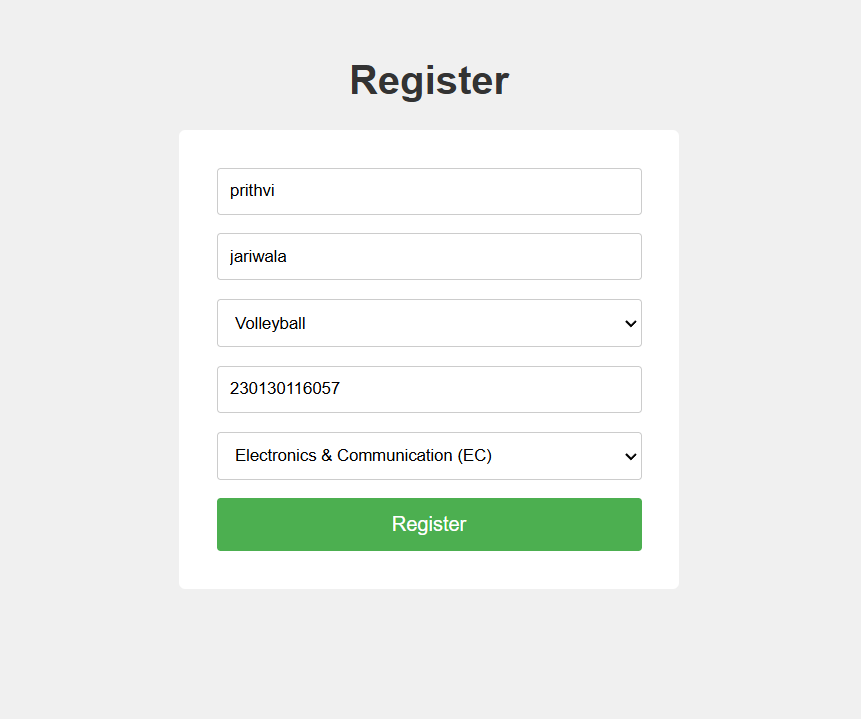
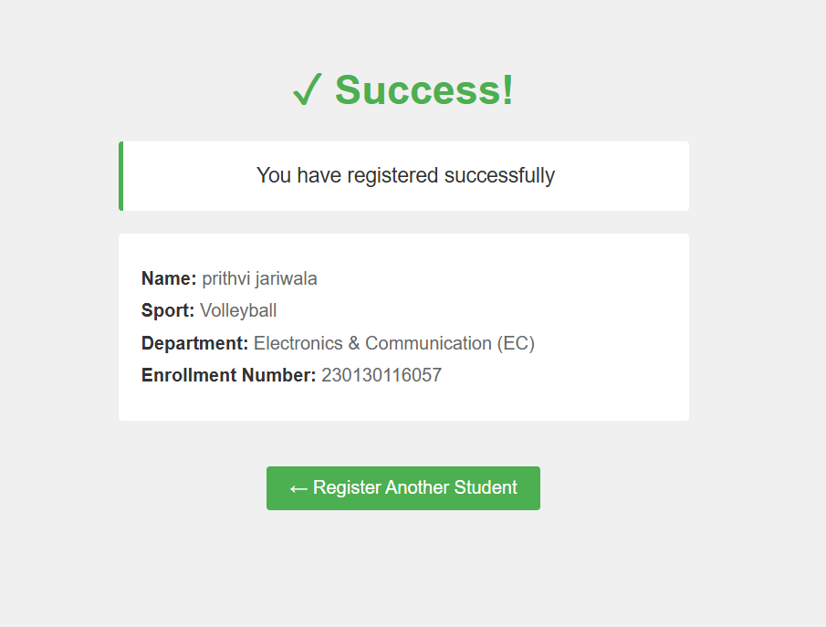
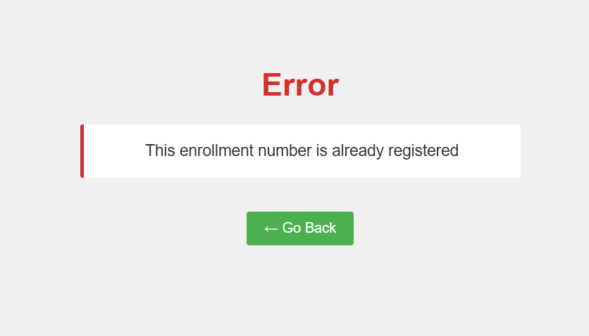
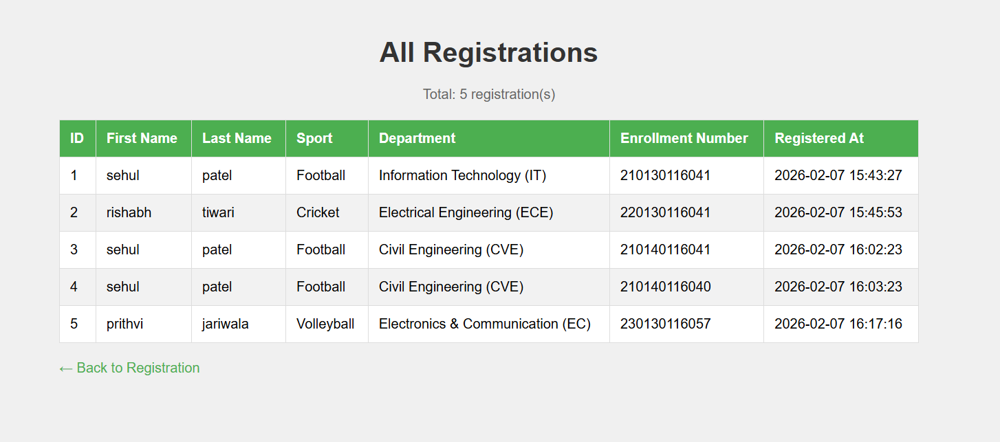

# Sports Registration System

A simple web application for registering students for sports activities. Built with Flask and stores registrations in JSON format.

## Features

- Student registration form with validation
- Prevents duplicate enrollment numbers
- Stores data in JSON file
- View all registrations in a table
- Timestamps for each registration

## Technologies Used

- **Python 3.x**
- **Flask** - Web framework
- **JSON** - Data storage
- **HTML/CSS** - Frontend

## Installation

1. **Clone or download this project**

2. **Install Flask**
```bash
   pip install flask
```

3. **Run the application**
```bash
   python app.py
```

4. **Open in browser**
```
   http://localhost:5000/
```

## Project Structure
```
sports-registration/
│
├── app.py                      # Main Flask application
├── registrations.json          # Data storage (auto-created)
│
└── templates/
    ├── index.html              # Registration form
    ├── success.html            # Success message page
    ├── error.html              # Error message page
    └── registrations.html      # View all registrations
```

## How It Works

### Registration Form (`/`)
- First Name (required)
- Last Name (required)
- Sport (dropdown - required)
- Enrollment Number (10 digits - required, unique)
- Department (dropdown - required)

### Validation Rules
- ✓ All fields are required
- ✓ Enrollment number must be exactly 10 digits
- ✓ Enrollment number must be unique (no duplicates)
- ✓ Sport and Department must be from the predefined lists

### Available Sports
- Football
- Cricket
- Chess
- Kabaddi
- Volleyball
- Badminton

### Available Departments
- Information Technology (IT)
- Computer Engineering (CE)
- Biomedical Engineering (BM)
- Electrical Engineering (ECE)
- Civil Engineering (CVE)
- Electronics & Communication (EC)
- Instrumentation & Control Engineering (IC)

## Routes

| Route | Method | Description |
|-------|--------|-------------|
| `/` | GET | Display registration form |
| `/register` | POST | Process registration |
| `/registrations` | GET | View all registrations |

## Data Storage

Registrations are stored in `registrations.json` with the following structure:
```json
[
    {
        "id": 1,
        "first_name": "John",
        "last_name": "Doe",
        "sport": "Football",
        "department": "Computer Engineering (CE)",
        "enrollment_number": "1234567890",
        "registered_at": "2026-02-07 14:30:45"
    }
]
```

## Code Explanation

### Key Functions

**`load_registrations()`**
- Loads all existing registrations from JSON file
- Returns empty list if file doesn't exist

**`save_registrations(registrations)`**
- Saves all registrations to JSON file
- Uses indent=4 for readable formatting

**`check_enrollment_exists(enrollment_no)`**
- Checks if an enrollment number is already registered
- Returns True if exists, False otherwise

**`add_registration(...)`**
- Validates enrollment number is unique
- Creates new registration with auto-incrementing ID
- Adds timestamp
- Saves to JSON file

## Common Issues & Solutions

**Problem:** Flask not found
```bash
# Solution: Install Flask
pip install flask
```

**Problem:** Port already in use
```python
# Solution: Change port in app.py
if __name__ == "__main__":
    app.run(debug=True, port=5001)  # Use different port
```

**Problem:** Data not saving
- Check file permissions in the project directory
- Make sure `registrations.json` can be created/written

## Future Improvements

- [ ] Add search functionality
- [ ] Export registrations to Excel/CSV
- [ ] Add email confirmation
- [ ] User authentication for admin panel
- [ ] Edit/Delete registrations
- [ ] Add student photos
- [ ] Statistics dashboard
- [ ] Filter by sport or department

## Screenshots

### Registration Form
Simple form with dropdown menus for Sport and Department selection.


### Success Page
Displays confirmation with all registered details.


### Error page
Displays error if same enrollment is trying to register again


### All Registrations
Table view showing all registered students with their details.


## License

This project is free to use for educational purposes.

## Author

Created for learning Flask web development and form handling.

---

**Note:** This is a learning project. For production use, consider:
- Adding a proper database (SQLite/PostgreSQL)
- Implementing user authentication
- Adding CSRF protection
- Using environment variables for configuration
- Adding proper logging
- Implementing backup system